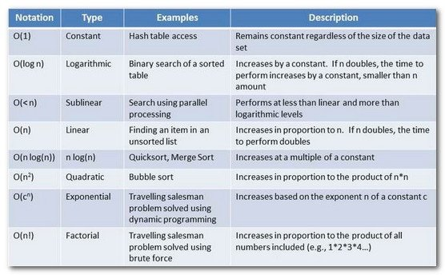
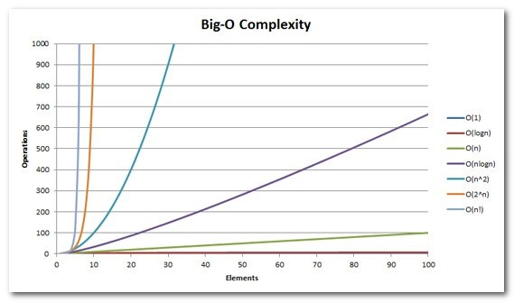

## Algorithms and Data Structures

- YouTube
  - [Linguagem C Programação Descomplicada](https://www.youtube.com/user/progdescomplicada/videos)
- Sites
  - [GeeksForGeeks](https://www.geeksforgeeks.org/)
  - [AssemblyProgressivo.net](https://www.assemblyprogressivo.net/)
- GitHub Repositories
  - [https://github.com/antlr/grammars-v4](https://github.com/antlr/grammars-v4)
- Code Training
  - [Project Euler](https://projecteuler.net/)
  - [HackerRank](https://www.hackerrank.com/)
  - [LeetCode](https://leetcode.com/)
  - [Edabit](https://edabit.com)
  - [Exercism](https://exercism.org/)
  - [AlgoExpert.io](https://www.algoexpert.io/product)
  - [URI Online Judge](https://www.urionlinejudge.com.br/judge/en/login)
  - [7 Days Of Code](https://7daysofcode.io/)
  - [100 days of code](https://www.100daysofcode.com/)
- KhanAcademy
  - [Computer Science](https://www.khanacademy.org/computing/computer-science)
  - [Notação assintótica](https://pt.khanacademy.org/computing/computer-science/algorithms/asymptotic-notation/a/asymptotic-notation)
- Recursion 💀
  - [O que é recursão? Teste de Mesa com Fatorial - Softblue](https://www.youtube.com/watch?v=V60g61dhKmg)
- Visualization of Data Structures
  - [VisualGo](https://visualgo.net/en)
  - [University of San Francisco - CS](https://www.cs.usfca.edu/~galles/visualization/Algorithms.html)
  - [https://bit.ly/3vKoans](https://bit.ly/3vKoans)
- Big O Notation 💀
  - [bigocheatsheet.com](http://bigocheatsheet.com/)
  - [https://bit.ly/3GpYZvs](https://bit.ly/3GpYZvs)
  - <b> O(1) Constant Time </b>
    - Best possible case
    - If an algorithm has constant time, it means that it will always take the same amount of time to produce the result.
    - Example: array.pop() -> removing the last item from an array, regardless of size, will always take the same amount of time!
  - <b>Logarithms O(logn)</b>
    - Preferable most of the time
    - Logarithms are the inverse of exponentiation.
    - Example: Binary search algorithm -> divide and conquer
    - 
  - <b>Linear time O(n)</b>
    - Preferable most of the time
    - If an algorithm has linear time, it means that the execution time increases linearly according to the size of the input.
    - Example: array.forEach() sum of all values
  - <b>Linear Logarithms O(n log n)</b>
    - Acceptable
    ```
    x = n
    while ( x > 0 ) {
      y = x
      while ( y > 0 ) {
         y = y / 2
      }
      x -= 1
    }
    ```
    - Examples: Quicksort, Mergesort and Heapsort -> dividir para conquistar
  - <b>Quadratic time O(n²)</b> 💀
    - Good to avoid
    - The running time of this algorithm is directly proportional to the square of the input.
    - That is: 2->4 3->9 4->16 5->25 etc
    - Example: Sum of matrices
    ```
    for (var outer = 0; outer < elements.Count; outer++){
      for (var inner = 0; inner < elements.Count; inner++){
        ...
      }
    }
    ```
  - <b>Exponential Time O(2^n)</b> 💀 💀
    - One of the worst cases, always good to avoid
    - Indicates an algorithm whose growth doubles with each addition to the input data set. The growth curve of an O(2N) function is exponential - starting very shallow and then rising meteorically
    - Example: recursive calculation of Fibonacci numbers
    ```
    int Fibonacci(int number){
        if (number <= 1) return number;
        return Fibonacci(number - 2) + Fibonacci(number - 1);
    }
    ```
  - <b>Factorial Time O(n!)</b> 💀 💀 💀
    - Always try to avoid!
    - Extremely non-performative
    - Will run in factorial time for each operation
    - Example: Traveling Salesperson Problem
      - "Given a list of cities and the distances between each pair of cities, what is the shortest possible path that visits each city and returns to the city of origin?"
  - <strong>Resume</strong>
    - 
    - 
