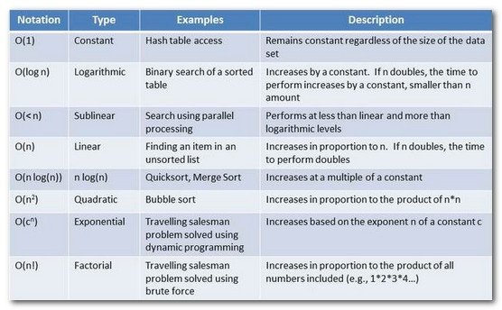
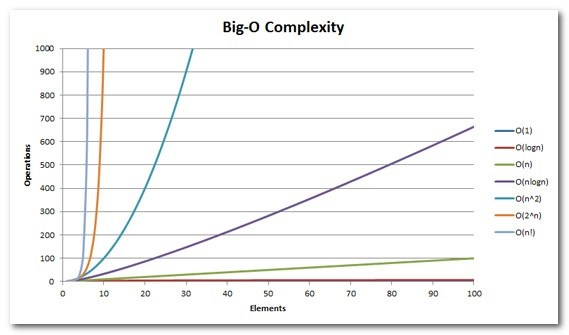

## Algorithms and Data Structures

- YouTube
  - [Linguagem C Programação Descomplicada](https://www.youtube.com/user/progdescomplicada/videos)
- Sites
  - [GeeksForGeeks](https://www.geeksforgeeks.org/)
  - [AssemblyProgressivo.net](https://www.assemblyprogressivo.net/)
- GitHub Repositories
  - [https://github.com/antlr/grammars-v4](https://github.com/antlr/grammars-v4)
- Treinamento de Código
  - [Project Euler](https://projecteuler.net/)
  - [HackerRank](https://www.hackerrank.com/)
  - [LeetCode](https://leetcode.com/)
  - [Edabit](https://edabit.com)
  - [Exercism](https://exercism.org/)
  - [AlgoExpert.io](https://www.algoexpert.io/product)
  - [URI Online Judge](https://www.urionlinejudge.com.br/judge/en/login)
  - [7 Days Of Code](https://7daysofcode.io/)
  - [100 days of code](https://www.100daysofcode.com/)
- KhanAcademy
  - [Computer Science](https://www.khanacademy.org/computing/computer-science)
  - [Notação assintótica](https://pt.khanacademy.org/computing/computer-science/algorithms/asymptotic-notation/a/asymptotic-notation)
- Recursão :skull:
  - [O que é recursão? Teste de Mesa com Fatorial - Softblue](https://www.youtube.com/watch?v=V60g61dhKmg)
- Visualização de Estruturas de Dados :skull:
  - [VisualGo](https://visualgo.net/en)
  - [University of San Francisco - CS](https://www.cs.usfca.edu/~galles/visualization/Algorithms.html)
  - [https://www.cs.usfca.edu/~galles/visualization/AVLtree.html](https://www.cs.usfca.edu/~galles/visualization/AVLtree.html)
- Big O Notation :skull:
  - [bigocheatsheet.com](http://bigocheatsheet.com/)
  - [A coffee-break introduction to time complexity of algorithms](https://dev.to/vickylai/a-coffee-break-introduction-to-time-complexity-of-algorithms-160m?utm_source=digest_mailer&utm_medium=email&utm_campaign=digest_email)
  - O(1) Constant Time
    - Melhor caso possível
    - Se um algoritmo possui tempo constante, significa que sempre vai levar o mesmo tempo para produzir o resultado.
    - Exemplo: array.pop() -> tirar último item de um array, independente do tamanho, levará sempre o mesmo tempo!
  - Logarithms O(log n)
    - Preferível na maioria das vezes
    - Logaritimos são o inverso da exponenciação.
    - Exemplo: Algoritmo de busca binária -> dividir para conquistar
    - 
  - Linear time O(n)
    - Preferível na maioria das vezes
    - Se um algoritmo possui tempo linear, significa que o tempo de execução aumenta linearmente de acordo com o tamanho do input.
    - Exemplo: array.forEach() soma de todos os valores
  - Linear Logarithms O(n log n)
    - Aceitável
    ```
    x = n
    while ( x > 0 ) {
      y = x
      while ( y > 0 ) {
         y = y / 2
      }
      x -= 1
    }
    ```
    - Examples: Quicksort, Mergesort and Heapsort -> dividir para conquistar
  - Quadratic time O(n²) :skull:
    - Bom evitar
    - O tempo de execução desse algoritmo é diretamente proporcional ao o quadrado do input.
    - Ou seja: 2->4 3->9 4->16 5->25 etc
    - Exemplo: Soma de matrizes
    ```
    for (var outer = 0; outer < elements.Count; outer++){
      for (var inner = 0; inner < elements.Count; inner++){
        ...
      }
    }
    ```
  - Exponential Time O(2^n) :skull: :skull:
    - Um dos piores casos, sempre é bom evitar
    - Indica um algoritmo cujo crescimento dobra a cada adição ao conjunto de dados de entrada. A curva de crescimento de uma função O (2N) é exponencial - começando muito rasa e depois subindo meteoricamente
    - Exemplo: recursive calculation of Fibonacci numbers
    ```
    int Fibonacci(int number){
        if (number <= 1) return number;
        return Fibonacci(number - 2) + Fibonacci(number - 1);
    }
    ```
  - Factorial Time O(n!) :skull: :skull: :skull:
    - Sempre tente evitar!
    - Extremamente não perfomático
    - Vai executar em tempo fatorial para cada operação
    - Exemplo: Problema do vendedor viajante
      - "Dada uma lista de cidades e as distâncias entre cada par de cidades, qual é o caminho mais curto possível que visita cada cidade e retorna à cidade de origem?"
  - <strong>Resumo</strong>
    - 
    - 
